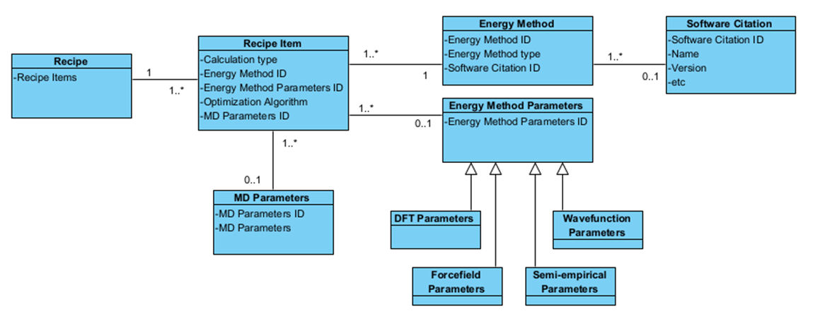

# CSP Data Standards: Assimilation of Outcomes

## Conceptual Model

## Data Categories

| Category | Description |
|-----------|-------------|
| Chemical System | One or more chemical components of the structure being predicted/calculated. A prediction may involve different combinations of these components. |
| Structure Generation Methods | The methods used to generate initial candidate structures that are then subsequently optimised for possible inclusion in a final landscape.   Retrieving a 3D structure from an existing database could be considered as a form of “structure generation” so TCOD methods relating to this fit here. See:   https://wiki.crystallography.net/cif/dictionaries/ddl1/cif_tcod/ |
| Energy and Optimization Methods | The method(s) used to optimize a structure and calculate its energy. |
| Simulation Conditions | Simulation temperature/pressure if specified. Will need to report with structure as a landscape may contain structures simulated under different conditions. |
| Predicted Structures | The 3D crystal structures resulting from the calculation / prediction and contributing to an overall landscape. |
| Energies | The energies calculated for each calculated / predicted structure.   Expect total energy, absolute free energy or absolute lattice energy.   Allow for free energy to be expressed as lattice energy + free energy correction.   Accommodate relative lattice energies but encourage one of the others.   Define terms for energy uncertainties / standard error.  May want to be able to know the method(s) used for calculating final energy – this might be best captured in the list of methods used. |
| Structure Rank | Optional - allows for alternative ranking methods to be captured. Will assume ranking is based on energy if not provided. |

## Not considered in great detail for this use case

| Category | Description |
|-----------|-------------|
| Instruction Files | Per TCOD dictionaries. |
| Software Packages | Identification of software packages used, drawing on the Software Citation Principles. |
| References | References to articles that describe methods used.   Might want to be able to link reference to a particular structure generation method or an energy/optimisation method. |

## Structure Similarity (considered to be out of scope)

| Category | Description |
|-----------|-------------|
| Experimental structures | The experimental structure(s) used as a reference for structure similarity calculation. |
| Structure Similarity Methods | Methods used to determine the similarity of predicted structures to experimental ones |
| Similarity Scores | For PXRD cross correlation or PDD methods a number between 0 and 1 with 1 being identical (same but reversed for VC-PWDF),   for CPS/Compack an integer for number of molecules matching (n), and a float (0.0+) for RMSDn |

## Input Chemical System

One or more chemical components of the structure being predicted/calculated. A prediction may involve different combinations of these components.

| Category | Description |
|-----------|-------------|
| Chemical name | See name_common and name_systematic from Core CIF dictionary.   name_mineral and name_structure_type likely to be relevant for some inorganics. |
| Chemical formula | Need to decide which from Core CIF dictionary are appropriate for describing a component and which for describing overall structure (moiety vs sum - also IUPAC and structural). |
| Chemical identifier | InChI / InChI Key / InChI Version. |
| Chemical connectivity | Potentially using existing chemical_conn data items.   Might also want to capture SMILES or a MOL file representation. |
| Chemical component reference identifier | In case it is needed to reference a component from elsewhere (distinct from chemical identifiers). |

## Structure Generation Methods

The methods used to generate initial candidate structures that are then subsequently optimised for possible inclusion in a final landscape.

Retrieving a 3D structure from an existing database could be considered as a form of “structure generation” so TCOD methods relating to this fit here.

| Category | Description |
|-----------|-------------|
| Space groups used for structure generation | Space group selection could be “all” or “subset”.   Space group number list if a subset was used
| Structure generation method, e.g.:   - Evolutionary algorithm   - Random sampling   - Simulated annealing   - Monte Carlo sampling   - Quasi-random sampling   - Monte Carlo Parallel tempering   - Particle swarm optimisation | Suggest aiming for a controlled vocabulary but may need to expand on the one provided for the Blind Test.   Allow “Other” and a data item to provide additional details. |
| Ranking method | Free text description of how structures are ranked if not by reported energies. Assume structures ranked by energy if this is not specified. |
| Software citation | Details of the software used for structure generation. Could be included explicitly here or perhaps better, reference a separate citation object. |
| Source of structure if starting point is from a database or file | See the following from CIF_TCOD:   - TCOD Data Source  - TCOD Source Structure Database   - TCOD Source Database |

## Energy and Optimization Methods

The method(s) used to optimize a structure and calculate its energy.

Working hypothesis is that the same terms can be used to describe methods for both calculation and optimization of energy on the basis that an optimization method is essentially a single point energy calculation combined with an optimization algorithm. We have also considered methods that use molecular dynamics (MD).

Would like to establish a way that enables the methods used to be listed in order along with the parameters used and the purpose of the calculation with minimal duplication of data.

The following is an initial attempt to organize the key concepts we would like to capture and distinguish these - there may be better ways of conceptualizing this.

The separation of Method from Method Parameters allows the same method to be repeated with different parameters. Also allows high level description of methods used without detailed parameters (even if that would not be recommended). 

Recipe Item: A Recipe Item is a calculation undertaken for a particular purpose with a particular set of parameters contained in an ordered list (or Recipe).

| Category | Description |
|-----------|-------------|
| Calculation type:  - Optimisation - Ensemble Average - Single point - Free Energy Correction | Indicates what the primary result of the calculation is. Ensemble Average implies dynamics. Free energy correction allows free energy to be determined based on a correction to the lattice energy |
| Energy Method identifier | Internal reference to energy method description. |
| Energy Method Parameters identifier | Internal reference to parameters used for energy calculation. |
| Optimization algorithm. e.g.: - BFGS - L-BFGS - Quasi-Newton - FIRE - Steepest Descent - Conjugate Gradient - Other | Controlled vocabulary with free text field for “Other”. Would be null or absent if calculation was not an optimization. |
| Molecular Dynamics Parameters identifier | Internal identifier referencing a block of parameters relevant if the method uses molecular dynamics. Proposed in seperate document  Would be null or absent if dynamics is not involved. |
| Whether method was used for calculating final energy | CSP Blind test dictionaries had a flag to indicate “preliminary” vs “final” for methods used at various stages. We may want to have something that at least indicates which method(s) were used to calculate final energy. |

## Method Description

| Category | Description |
|-----------|-------------|
| Method type, e.g.: - Force Field - Semi-empirical - DFT - Wavefunction - AI - Other | Controlled vocabulary with free text field for “Other”. Debate around “AI” - distinction between use of AI to improve other methods vs use of AI to optimize structure - only the latter should be designated “AI”. If AI is used, should training data be indicated? |
| Software citation | Details of the software used for the calculation described. Could be included explicitly here or perhaps better, reference a separate citation object. |
| Energy Method identifier | Internal identifier for referencing the method description so this can be referred to elsewhere. |

## Method Parameters

| Common to all methods |  |
|-----------|-------------|
| Energy Method parameter reference identifier | Internal identifier for referencing the parameter set used by a particular calculation. |

| DFT Parameters | Notes |
|-----------|-------------|
| Blind test recommended the following data items:  - approximation - functional - dispersion correction - basis set K point grid has additionally been highlighted as important.| Detailed description of a DFT calculation can be provided by the TCOD DFT dictionary terms, see: https://wiki.crystallography.net/cif/dictionaries/ddl1/cif_dft/ .  Specific items listed are those considered important to report for a general understanding of the parameters used and to support assessment of the results. cell_energy_conv from TCOD DFT dictionary also noted as useful but may also be applicable beyond just DFT. |

| ForceField Parameters | Notes |
|-----------|-------------|
| Blind Test recommended just name and description. | A more comprehensive list of terms could be accommodated, detailed seperately |

| Semi-Empirical Parameters | Notes |
|-----------|-------------|
| Blind test recommended just the name of the method be reported | Suggest that Semi-empirical dispersion correction is needed. |

| Wavefunction Parameters | Notes |
|-----------|-------------|
|Blind test recommended the following data items: Electronic method Basis set| |

## Results

The results will be one or more structures, each reported with the following information when applicable:

- Predicted crystal structure
- Calculated energy
- Simulation conditions
- Structure rank

## Predicted Crystal Structure

All from Core CIF Dictionary unless otherwise indicated.

| Category | Description |
|-----------|-------------|
| Formula | Blind test recommended chemical_formula_sum but chemical_formula_moiety would also be useful. |
| Space Group | Specifically space_group_name_H-M (not -alt as asked for in blind test!) |
| Cell | a, b, c, alpha, beta, gamma, volume, Z |
| Density | Calculated density |
| Atom sites | Fractional Coordinates |

May want to have a link back to chemical system to indicate the stoichiometry of the starting components in the final structure.

## Simulation Conditions

Simulation temperature/pressure if specified. It is anticipated that structures on the same landscape will be simulated using the same conditions, but the alternative can be considered.

| Category | Description |
|-----------|-------------|
| Simulation Temperature | 0K if not specified. Assume we need a data item specifically for simulated temperature, i.e. don’t try and reuse diffraction temperature from Core CIF dictionary.|
| Simulation Pressure |If relevant to a particular structure. Specific for theoretical structures. |

## Energies

| Category | Description |
|-----------|-------------|
| Total Energy | Base on TCOD data items |
| Absolute free energy | For CSP landscapes expect this or absolute lattice energy |
| Absolute lattice energy | For CSP landscapes expect this or absolute free energy |
| Free energy correction | Allows for free energy to be determined/reported as lattice energy + free energy correction. |
| Relative lattice energy | Allow for this as it is often reported but encourage/require one of the other energies |
| Energy uncertainty / standard error | |

## Ranking

| Category | Description |
|-----------|-------------|
| Rank | The rank of the structure when ordered by chosen criteria where 1 is considered to be the most favorable or likely structure. |
| Ranking score | To allow for methods that may rank by criteria other than energies. |
